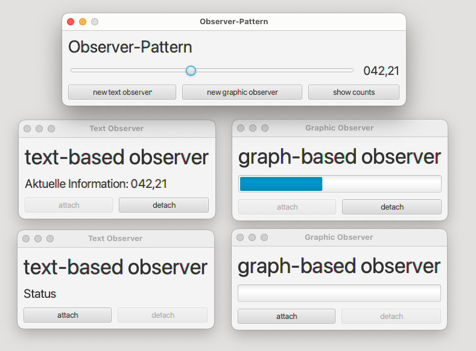

# Singleton, Observer, Adapter Patterns

This project demonstrates the implementation of three primary design pattern categories - generation, structure, and behavior patterns. The project is divided into two parts, focusing on a representative pattern from each category: Singleton, Observer, and Adapter, using Java FX to integrate these patterns. All three parts can be tested within the terminal, but work together in a window application.

# Observer

The Observer pattern is a behavioral design pattern that establishes a one-to-many dependency between objects, where a change in one object (subject) automatically triggers updates in dependent objects (observers). This pattern promotes loose coupling, as subjects and observers are only aware of a minimal interface. Subjects maintain a list of observers, providing methods to add or remove observers. When a subject's state changes, it notifies all registered observers, which then update themselves accordingly. Examples include UI updates based on data changes and event-driven programming.

## Main (Main)

This class utilizes the observer behavior pattern and connection with the adapter structure. In this example, the slider class acts as an adapter, inheriting from the observable class and adapting Java FX's slider component. The adapter enables the integration of a custom Observer pattern implementation with Java FX's event system to control a global counter variable within an infinite amount of windows.

### GUI



# Singleton

The Singleton pattern is a creational design pattern that ensures a class has only one instance and provides a global point of access to that instance. It helps to manage global states and control shared resources by restricting instantiation of a class to a single object. Singleton is implemented by creating a private constructor, a static method to access the single instance, and a static variable to hold that instance. This pattern ensures controlled and consistent access to shared resources, reducing potential conflicts and simplifying resource management across the application.

This class handles a global counter class throughout the application.

## SingletonSample (Main)

### Terminal Output

```
Neuer Zaehler wird erstellt und um 10 erhoeht
---Counter 1 Status: 66
Neuer Zaehler wird erstellt und um 7 erhoeht
---Counter 2 Status: 156
Aktuellen Zaehlerstand abrufen:
---Counter 1 Status: 156
---Counter 2 Status: 156

```
