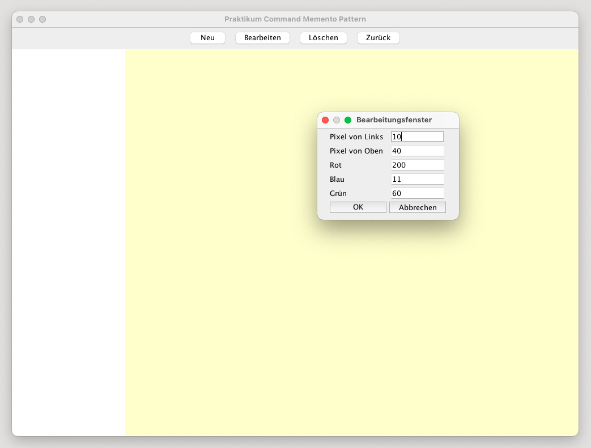
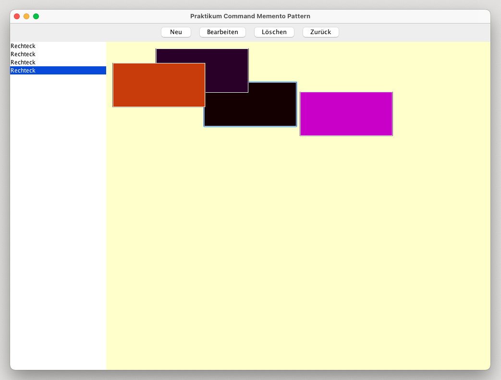

# Command and Memento Pattern

The Command pattern is a behavioral design pattern that encapsulates requests or operations as objects, allowing them to be easily parameterized, queued, or logged. By decoupling the sender and receiver of a request, this pattern enables greater flexibility and extensibility in software systems.

The Memento pattern is another behavioral design pattern that enables capturing and externalizing an object's internal state without violating encapsulation. It allows restoring the object to a previous state when needed.

Together, these patterns provide an effective way to manage application state and implement features such as undo and redo, while maintaining clean and extensible code.

## ProgramMain (Main)

This Java application demonstrates the Command pattern in a simple graphics editor. Users can create, modify, and delete colored rectangles on the screen. Each command is implemented using the Command pattern, enabling multiple ways to execute them, including function buttons and list box context menus.

The application also incorporates the Memento pattern for implementing an Undo feature, allowing users to revert to previous states of shapes.

### GUI

